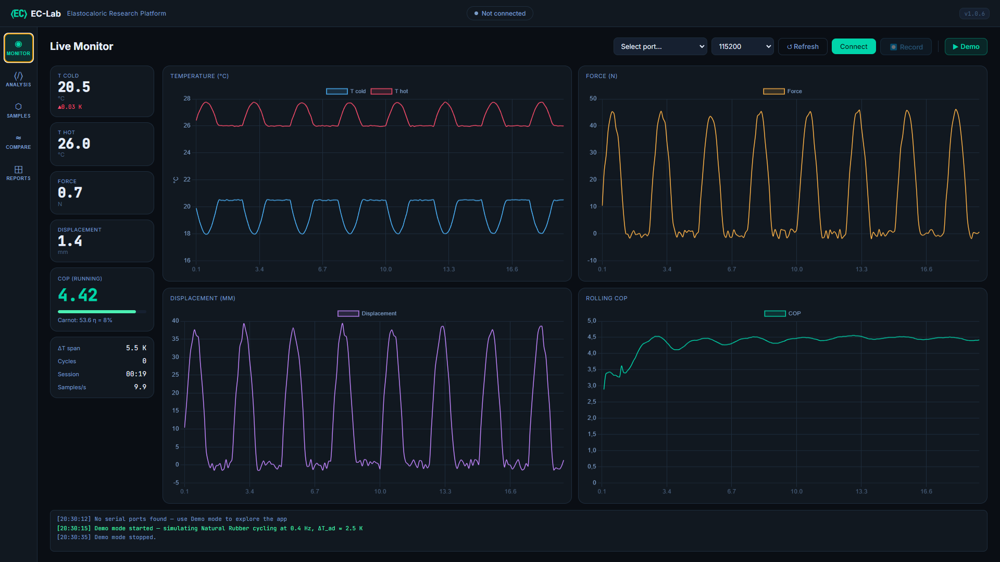

# Low-Cost Elastocaloric Heat Pump — Polymer Film Platform

[](https://github.com/OutBlade/elastocaloric-heat-pump/actions/workflows/validate.yml)
[](https://github.com/OutBlade/elastocaloric-heat-pump/actions/workflows/release-app.yml)
[](https://www.python.org/)
[](LICENSE)

**Research project** · Institute of Microstructure Technology (IMT) · KIT  
*Zero-emission Thermal Technologies — Dr. Jingyuan Xu Group*

---

## EC-Lab — Desktop App

[](https://github.com/OutBlade/elastocaloric-heat-pump/releases/latest)

<p align="center">
  
</p>

<p align="center"><sub>
  Live Monitor tab in Demo Mode — Natural Rubber film cycling at 0.4 Hz, ΔT<sub>ad</sub> ≈ 2.5 K, rolling COP 4.42.
  All four sensor channels update at 10 Hz. No hardware required to explore the interface.
</sub></p>

EC-Lab is a dedicated desktop research tool for daily lab use — live serial monitor from the Arduino controller, in-app DSC and COP analysis, polymer film sample database with fatigue tracking, material comparison against the SMA baseline, and one-click HTML report export. A built-in **Demo Mode** runs a full simulated elastocaloric cycle so every feature works without connecting any hardware.

> Installs in one click. Updates automatically in the background.
> See [`app/`](app/) for source code and development instructions.

---

## Motivation

Conventional vapor-compression cooling accounts for roughly 20 % of global electricity consumption and relies on HFC refrigerants with global-warming potentials orders of magnitude above CO₂. Elastocaloric (eC) cooling eliminates both problems: the working body is a solid-state material — no refrigerant, no compressor, no leakage risk.

Shape-memory alloy (SMA) films already demonstrate world-class eC performance (ΔT_ad > 20 K, specific cooling power up to 19 W g⁻¹ for TiNiCuCo). This project asks the complementary question: **can polymer films achieve a practically useful eC effect at a fraction of the material cost?** Polymers such as natural rubber (NR), PVDF, and silicone elastomers cost < 5 € m⁻² and offer strain amplitudes exceeding 300 %, making them attractive for large-area, low-cost demonstrators even if their volumetric eC effect is smaller.

---

## Scientific Objectives

| # | Objective | Key Metric |
|---|-----------|------------|
| 1 | Characterize adiabatic temperature change ΔT_ad of candidate polymer films | ΔT_ad ≥ 2 K at ε = 200 % |
| 2 | Measure fatigue life under cyclic tensile loading | > 10⁵ cycles without fracture |
| 3 | Build and instrument a single-stage eC demonstrator | COP > 1 at ΔT_span = 5 K |
| 4 | Compare polymer eC performance against SMA baseline | Normalized W g⁻¹ and J cm⁻³ |

---

## Working Principle

```
      ┌─────────── STRESS APPLIED ──────────────┐
      │  Polymer chains align → entropy ↓        │
      │  Adiabatic temperature RISES (ΔT > 0)    │
      │  Heat rejected to hot side (heat sink)   │
      └──────────────────────────────────────────┘
                         │
               [mechanical cycle]
                         │
      ┌─────────── STRESS RELEASED ─────────────┐
      │  Chains relax → entropy ↑               │
      │  Adiabatic temperature DROPS (ΔT < 0)   │
      │  Heat absorbed from cold side (load)     │
      └──────────────────────────────────────────┘
```

The adiabatic temperature change under uniaxial stress is governed by:

```
ΔT_ad = − (T / ρ c_p) · (∂σ/∂T)_ε · Δε
```

where ρ is density, c_p specific heat, σ engineering stress, and Δε the applied strain amplitude.  
The Coefficient of Performance of an ideal regenerative eC cycle is:

```
COP_ideal = T_cold / (T_hot − T_cold)     [Carnot limit]
COP_device = Q_cold / W_mech              [measured]
```

---

## Repository Structure

```
elastocaloric-heat-pump/
├── materials/               # Raw characterization data per film type
│   ├── natural_rubber/
│   ├── pvdf/
│   └── silicone/
├── experiments/             # Measurement data organized by campaign
│   ├── 01_dsc/              # Differential scanning calorimetry
│   ├── 02_tensile/          # Stress–strain & fatigue testing
│   ├── 03_ir_thermography/  # IR camera recordings during cycling
│   └── 04_demonstrator/     # Full-cycle COP measurements
├── analysis/                # Python analysis scripts and notebooks
│   ├── dsc_analysis.py
│   ├── ir_thermography.py
│   ├── cop_calculator.py
│   └── notebooks/
│       └── 01_baseline_characterization.ipynb
├── design/                  # CAD and schematic files for demonstrator
├── firmware/                # Microcontroller code (Arduino/STM32)
├── results/                 # Processed figures and summary tables
├── docs/
│   ├── theory.md
│   ├── setup.md
│   └── materials_selection.md
└── .github/workflows/
    └── validate.yml
```

---

## Getting Started

### Requirements

- Python ≥ 3.11
- Hardware: linear actuator, force sensor, IR camera or thermocouple array, microcontroller

```bash
pip install -r requirements.txt
```

### Run the baseline characterization notebook

```bash
jupyter notebook analysis/notebooks/01_baseline_characterization.ipynb
```

### Validate all data files locally

```bash
python analysis/validate_data.py
```

---

## Candidate Materials

| Material | Max strain ε_max | ΔT_ad (literature) | Cost | Fatigue |
|----------|------------------|--------------------|------|---------|
| Natural rubber (NR) | ~600 % | ~2–4 K | ~1 € m⁻² | moderate |
| PVDF film | ~10 % | ~1–2 K | ~8 € m⁻² | high |
| Silicone elastomer | ~400 % | ~1–3 K | ~3 € m⁻² | high |
| NiTi SMA (reference) | ~8 % | ~15–25 K | ~500 € m⁻² | very high |

---

## Instrumentation

| Measurement | Method | Tool |
|-------------|--------|------|
| ΔT_ad during loading | IR thermography (FLIR / optris) | `analysis/ir_thermography.py` |
| Phase transition enthalpy | DSC (TA Instruments / Mettler) | `analysis/dsc_analysis.py` |
| Stress–strain behavior | Universal testing machine | `experiments/02_tensile/` |
| Strain field | Digital image correlation (DIC) | open-source Ncorr / µDIC |
| System COP | Power meter + thermocouple log | `analysis/cop_calculator.py` |

---

## Relation to IMT / ZET Research

This project directly extends the ZET group's SMA film-based eC cooling platform to low-cost polymer substrates, addressing the cost-scalability gap identified in recent SMA film device work (Xu et al., *Shape Memory and Superelasticity*, 2024). Polymer films share the large surface-to-volume advantage of SMA foils for solid-contact heat transfer while offering a dramatically reduced material cost — a prerequisite for residential and consumer-scale deployment.

---

## References

1. Xu J. et al. (2024). SMA Film-Based Elastocaloric Cooling Devices. *Shape Memory and Superelasticity*. https://doi.org/10.1007/s40830-024-00484-y  
2. Greibich F. et al. (2021). Elastocaloric heat pump with specific cooling power of 20.9 W g⁻¹. *Nature Energy*, 6, 260–267.  
3. Moya X. & Mathur N. D. (2020). Caloric materials for cooling and heating. *Science*, 370(6518), 797–803.  
4. Tušek J. et al. (2016). A regenerative elastocaloric heat pump. *Nature Energy*, 1, 16134.

---

## License

MIT — see [LICENSE](LICENSE)
